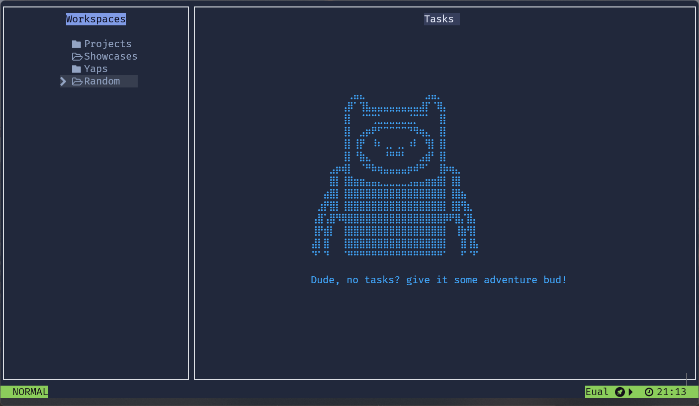
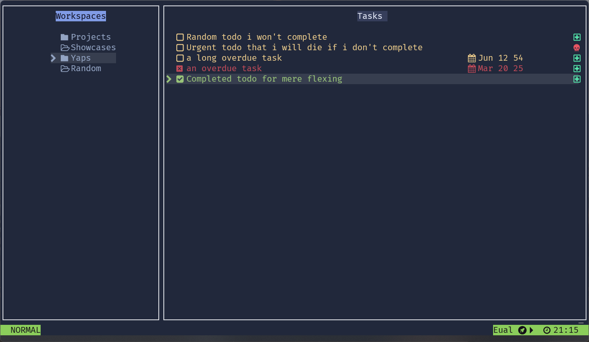
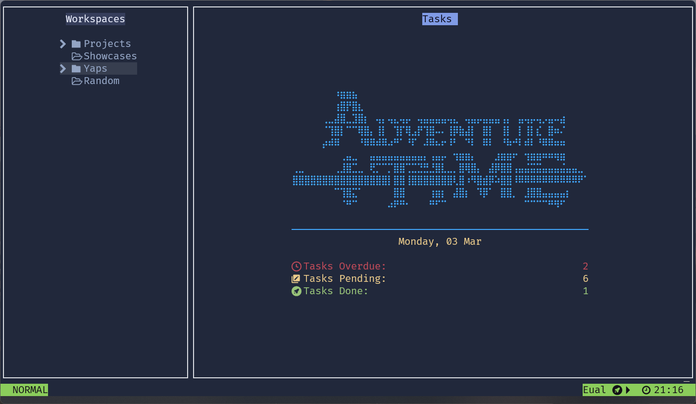
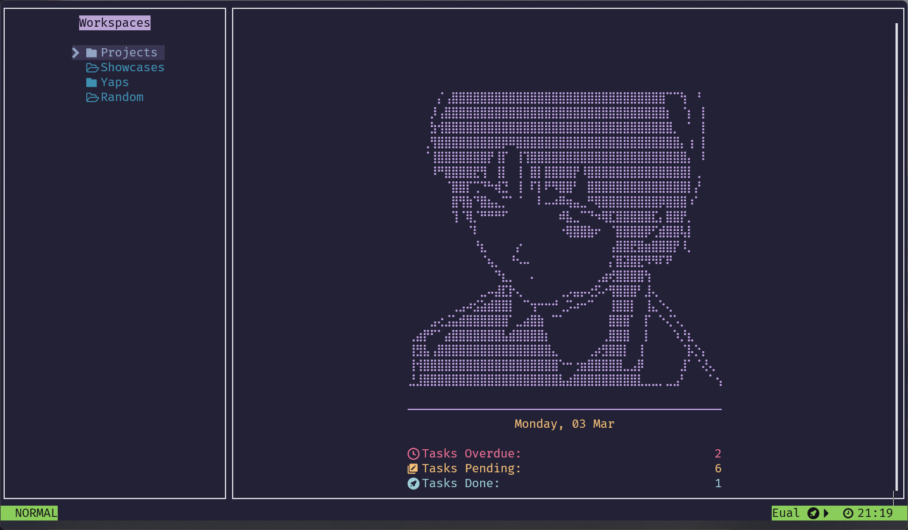
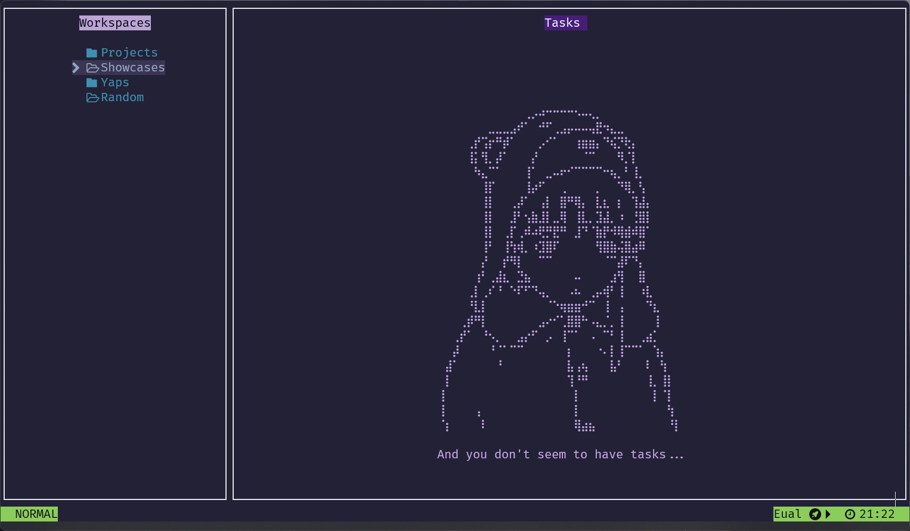
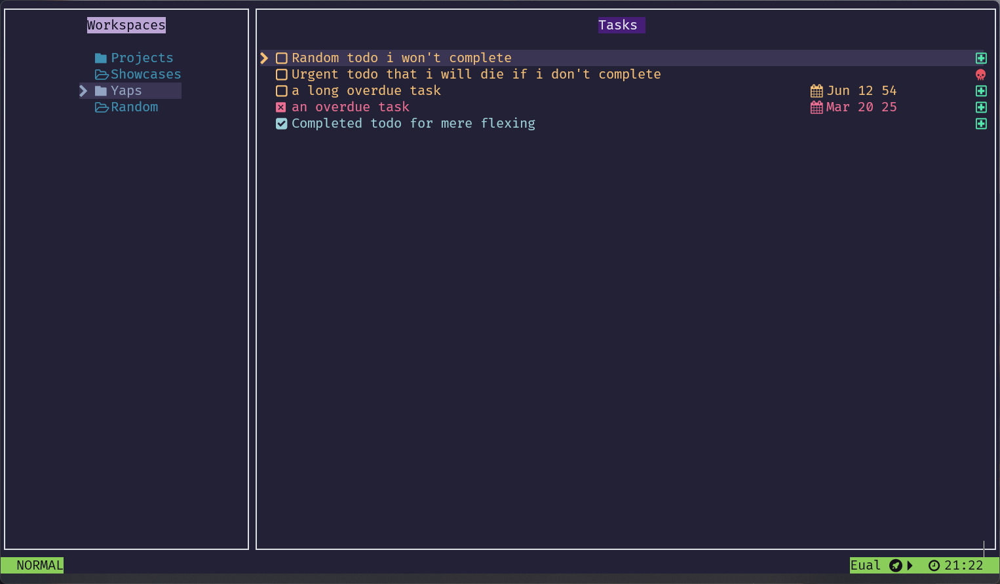
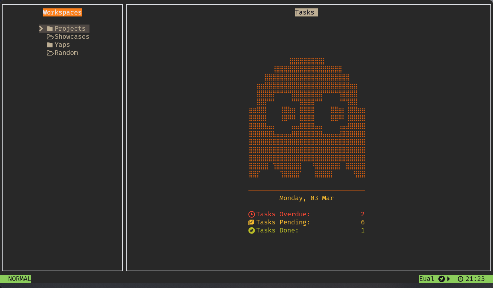
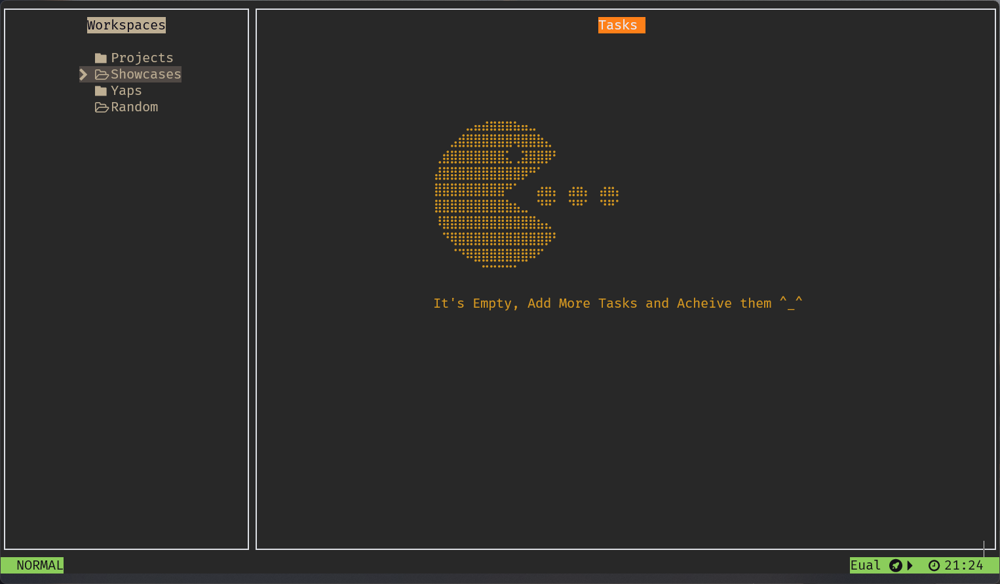
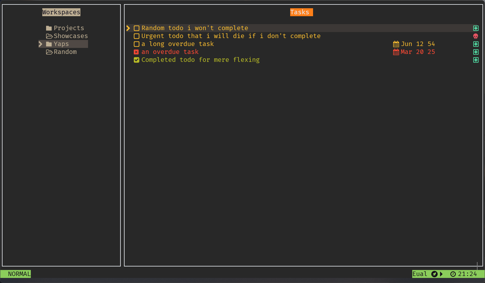

# FTodoX 
*A todo manager right in your terminal!*

-----------------------------


# Features 

- An interactive & beautiful UI 
- Vim like keybindings
- Custizable UI, currently limited to colors and dashboard :D
- Tasks and Configs are stored in simple YAML files for ease of access and editing
- Ability to add task due date, urgency add them to workspaces, sort them and much more!


# **Requirements**  
To build and run **FTodoX**, you need the following dependencies:  

- **C++17-compliant compiler** (GCC, Clang, or MSVC)  
- **[CMake](https://cgold.readthedocs.io/en/latest/first-step/installation.html)** build system  


## **Example Compilation (Windows)**

```sh
git clone https://github.com/Eual11/FTodoX
cd FTodoX
mkdir build && cd build

cmake .
cmake --build . --config Release
cd Release && ./FTodoX
```


# Usage and configuration

Aftr launching, press `?` to read the keybindings


When you first launch FToDoX, it will start with its default theme, which you can customize by changing the defined color values in `theme.yaml`.  

Initially, the dashboard banner will be missing because FToDoX requires `dashboard_banner.txt` and `no_tasks_banner.txt` to display the dashboard properly.  

To get started, navigate to `example/themes`, choose a theme, copy its contents, and paste them into FToDoX's directory.


# Screenshots 🖼️
Some screenshots with different customized configuration !

<details>
  <summary>Blue Adventure</summary>
  




</details>

<details>
  <summary> Meteorite Lain </summary>
  




</details>

<details>  
  <summary>Gruv Mode </summary>
  




</details>

# Showcase Video

<a href="">

 
</a>


# Contribution 
- Want to contribute? Feel free to Open PR or an Issue!

----------------------------

